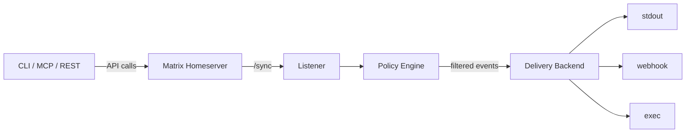

# matrixd

Matrix agent daemon — listener, tools, and hooks for AI agents.

## Overview

matrixd connects any AI agent platform to [Matrix](https://matrix.org) with policy-filtered event delivery. It works with OpenClaw, Claude Code, Talpa, and any platform that supports webhooks, stdio, or MCP.

**Zero runtime dependencies** — core uses only Python stdlib + vendored zerodep modules.

## Features

- 🔄 **Listener** — `/sync` long-polling with automatic reconnection and exponential backoff
- 🛡️ **Policy engine** — per-room event filtering: lurk, mention-only, all, important
- 📡 **Pluggable delivery** — stdout, webhook, exec (pipe to any process)
- 🔧 **CLI tools** — `matrixd send`, `matrixd rooms`, `matrixd listen`, `matrixd whoami`
- 🔌 **MCP server** — bidirectional Matrix tools + notifications *(coming soon)*
- 🌐 **REST server** — HTTP API for any language *(coming soon)*
- 📦 **Python library** — `import matrixd` for embedding in your own projects

## Quick Start

```bash
# Install
pip install matrixd

# Create config
cp matrixd.example.jsonc matrixd.jsonc
# Edit: set homeserver, token_file, room policies

# Verify credentials
matrixd whoami

# List rooms
matrixd rooms

# Send a message
matrixd send '!roomid:server' 'Hello from matrixd'

# Start listener
matrixd listen
```

## Architecture



## Relation to matrix-skill

[matrix-skill](https://github.com/Oaklight/matrix-skill) is a static SKILL.md that teaches agents to use `curl+jq` for Matrix API operations. It requires zero dependencies and works everywhere.

**matrixd** is the runtime companion:

- `matrix-skill` = knowledge (how to call the API)
- `matrixd` = runtime (persistent listener + typed Python client + delivery)

Use matrix-skill for on-demand API calls. Use matrixd for persistent inbound listening, policy filtering, or a tool server.

## Compatibility

| Platform | How to connect |
|----------|---------------|
| **OpenClaw** | Webhook delivery to session API, or MCP server |
| **Claude Code** | MCP server (stdio transport) |
| **Talpa** | Webhook or Python library import |
| **Any agent** | Webhook, exec, or stdout pipe |
