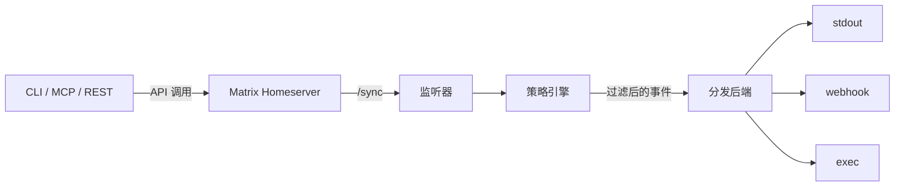

# matrixd

Matrix 智能体守护进程 — 面向 AI Agent 的监听器、工具和钩子。

## 概览

matrixd 将任意 AI Agent 平台接入 [Matrix](https://matrix.org)，通过策略过滤的事件分发实现消息桥接。支持 OpenClaw、Claude Code、Talpa 以及任何支持 webhook、stdio 或 MCP 的平台。

**零运行时依赖** — 核心仅使用 Python 标准库 + 内嵌的 zerodep 模块。

## 特性

- 🔄 **监听器** — `/sync` 长轮询，自动重连 + 指数退避
- 🛡️ **策略引擎** — 按房间过滤事件：lurk（静默）、mention-only（仅提及）、all（全部）、important（重要）
- 📡 **可插拔分发** — stdout、webhook、exec（管道到任意进程）
- 🔧 **命令行工具** — `matrixd send`、`matrixd rooms`、`matrixd listen`、`matrixd whoami`
- 🔌 **MCP 服务器** — 双向 Matrix 工具 + 通知 *（开发中）*
- 🌐 **REST 服务器** — HTTP API，支持任意语言调用 *（开发中）*
- 📦 **Python 库** — `import matrixd` 嵌入你自己的项目

## 快速开始

```bash
# 安装
pip install matrixd

# 创建配置
cp matrixd.example.jsonc matrixd.jsonc
# 编辑：设置 homeserver、token_file、房间策略

# 验证凭据
matrixd whoami

# 列出房间
matrixd rooms

# 发送消息
matrixd send '!roomid:server' '来自 matrixd 的消息'

# 启动监听
matrixd listen
```

## 架构



## 与 matrix-skill 的关系

[matrix-skill](https://github.com/Oaklight/matrix-skill) 是一个静态 SKILL.md，教 Agent 用 `curl+jq` 操作 Matrix API。零依赖，开箱即用。

**matrixd** 是运行时组件：

- `matrix-skill` = 知识层（怎么调 API）
- `matrixd` = 运行时（持久监听 + 类型化 Python 客户端 + 分发引擎）

一次性 API 调用用 matrix-skill。持久的入站监听、策略过滤或工具服务用 matrixd。

## 兼容性

| 平台 | 接入方式 |
|------|---------|
| **OpenClaw** | Webhook 分发到 session API，或 MCP 服务器 |
| **Claude Code** | MCP 服务器（stdio 传输） |
| **Talpa** | Webhook 或 Python 库导入 |
| **任意 Agent** | Webhook、exec 或 stdout 管道 |
