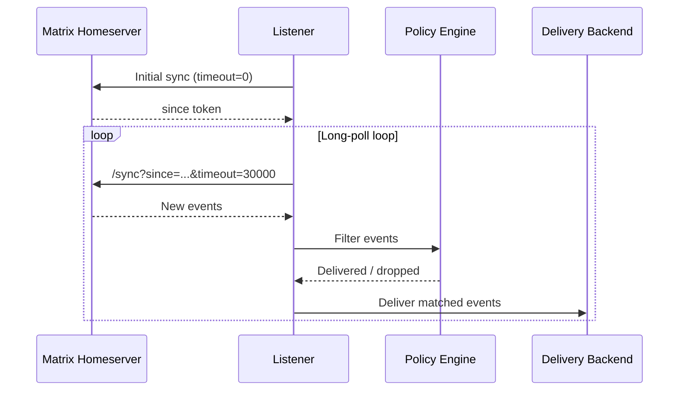

# Listener

The matrixd listener connects to your Matrix homeserver via the `/sync` API, filters events through the policy engine, and delivers them to your configured backend.

## Running the Listener

```bash
# Use config file delivery mode
matrixd listen

# Override delivery mode
matrixd listen --delivery stdout
matrixd listen --delivery webhook
```

## How It Works



## Policy Filtering

Events pass through the policy engine before delivery:

1. **Anti-echo** — bot's own messages are always dropped
2. **Room policy** — checked against per-room or default policy
3. **Mention detection** — checks body for `@user_id` or display name

### Example: Monitor one room, mention-only for others

```jsonc
{
  "default_policy": "mention-only",
  "rooms": {
    "!alerts:example.com": { "policy": "all" }
  }
}
```

## Error Handling

The listener automatically reconnects on errors with exponential backoff:

- Initial retry delay: **5 seconds**
- Maximum retry delay: **5 minutes**
- Resets to initial delay on successful sync

## Event Format

Delivered events (JSON mode):

```json
{
  "room_id": "!abc123:example.com",
  "event_id": "$event_id",
  "sender": "@alice:example.com",
  "type": "m.room.message",
  "body": "Hello, bot!",
  "msgtype": "m.text",
  "timestamp": 1700000000000,
  "content": { ... }
}
```

Plain text mode:

```
[!abc123:example.com] alice: Hello, bot!
```

## Using as a Library

```python
import asyncio
from matrixd.core.client import MatrixClient
from matrixd.core.listener import Listener, ListenerConfig
from matrixd.core.policy import RoomPolicy

async def main():
    async with MatrixClient("https://matrix.example.com", "syt_...") as client:
        config = ListenerConfig(
            default_policy=RoomPolicy.MENTION_ONLY,
            room_policies={
                "!alerts:example.com": RoomPolicy.ALL,
            },
        )
        listener = Listener(client, config)
        await listener.do_initial_sync()

        async for event in listener.listen():
            print(f"{event.sender}: {event.body}")

asyncio.run(main())
```
