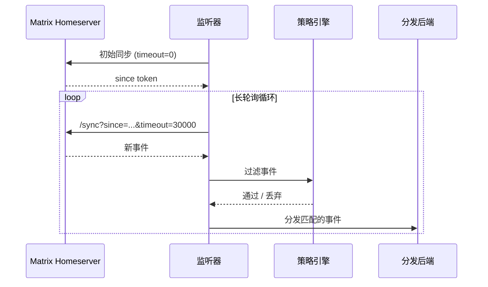

# 监听器

matrixd 监听器通过 `/sync` API 连接 Matrix homeserver，通过策略引擎过滤事件，然后分发到配置的后端。

## 运行监听器

```bash
# 使用配置文件中的分发模式
matrixd listen

# 覆盖分发模式
matrixd listen --delivery stdout
matrixd listen --delivery webhook
```

## 工作原理



## 策略过滤

事件在分发前经过策略引擎：

1. **反回声** — bot 自己的消息始终被丢弃
2. **房间策略** — 按房间策略或默认策略检查
3. **提及检测** — 检查消息体中是否包含 `@user_id` 或显示名称

### 示例：监控一个房间，其余仅提及

```jsonc
{
  "default_policy": "mention-only",
  "rooms": {
    "!alerts:example.com": { "policy": "all" }
  }
}
```

## 错误处理

监听器在出错时自动重连，使用指数退避策略：

- 初始重试延迟：**5 秒**
- 最大重试延迟：**5 分钟**
- 成功同步后重置为初始延迟

## 事件格式

分发的事件（JSON 模式）：

```json
{
  "room_id": "!abc123:example.com",
  "event_id": "$event_id",
  "sender": "@alice:example.com",
  "type": "m.room.message",
  "body": "你好，bot！",
  "msgtype": "m.text",
  "timestamp": 1700000000000,
  "content": { ... }
}
```

纯文本模式：

```
[!abc123:example.com] alice: 你好，bot！
```

## 作为库使用

```python
import asyncio
from matrixd.core.client import MatrixClient
from matrixd.core.listener import Listener, ListenerConfig
from matrixd.core.policy import RoomPolicy

async def main():
    async with MatrixClient("https://matrix.example.com", "syt_...") as client:
        config = ListenerConfig(
            default_policy=RoomPolicy.MENTION_ONLY,
            room_policies={
                "!alerts:example.com": RoomPolicy.ALL,
            },
        )
        listener = Listener(client, config)
        await listener.do_initial_sync()

        async for event in listener.listen():
            print(f"{event.sender}: {event.body}")

asyncio.run(main())
```
